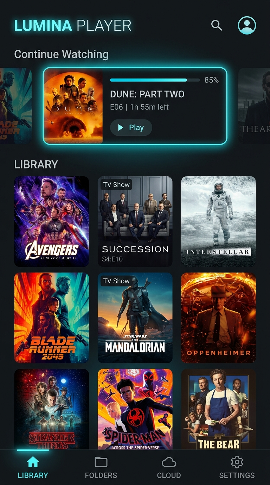
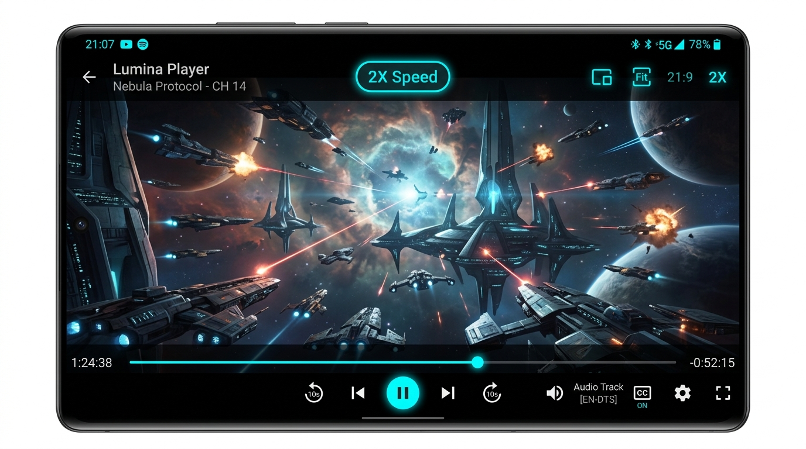

# Lumina Player

**Lumina Player** is a modern, high-performance local media player for Android designed with a sleek, minimalist dark aesthetic. Built strictly with Kotlin, Jetpack Compose (Material 3), and AndroidX Media3 ExoPlayer, Lumina Player brings a smooth desktop/mobile viewing experience to your movies, TV shows, and local video library.

---

## Features

- **Smart Local Library Scanner**: Automatically scans device folders, parses titles, episode info, and organizes media into Movies and TV Shows.
- **Advanced Subtitle Management**:
  - **Embedded Track Auto-Detection**: Seamlessly detects and lists embedded container sub-tracks (SRT, ASS, VTT, PGS, VobSub).
  - **Sidecar File Scanning**: Auto-discovers local `.srt`, `.vtt`, `.ass`, `.ssa`, and `.sub` files placed alongside your video files.
  - **Local Subtitle File Attachment**: Easily pick and attach custom subtitle files from internal storage or SD cards.
  - **Easy Subtitle Removal**: Instantly remove attached local subtitle tracks with a single tap directly inside the player UI.
  - **Online Subtitle Downloader**: Automatically fetch matching subtitles online via TMDb / OMDb integrations.
  - **AI Offline CC Generation**: Transcribe media on-demand using Gemini AI models.
  - **Custom Subtitle Styling**: Adjust font sizes, background colors, opacities, and typography styles on the fly.
- **Gesture Controls & Playback Controls**:
  - Swipe left/right for fast seeking with high-precision thumbnail previews.
  - Vertical swipe gestures for brightness and volume control.
  - Playback speed selection ($0.25\times$ to $2.0\times$), aspect ratio switching (Fit, Crop, Stretch), and background audio mode.
- **Metadata Enrichment**: Automatically fetches poster art, backdrops, plot synopses, release dates, genres, and cast details using OMDb / TMDb APIs.
- **Cloud Sync & Remote Streaming**: Connect to WebDAV / remote cloud storage sources to stream videos remotely and sync watch progress.
- **Minimalist Material 3 UI**: Clean dark canvas with dynamic accent colors, smooth entry transitions, and edge-to-edge support.

---

## Application Screenshots

<p align="center">
  
  &nbsp;&nbsp;&nbsp;&nbsp;
  
</p>

---

## Key Features

- **Gesture-Driven Playback Engine**:
  - **Press-and-Hold 2X Speed**: Long-press anywhere on the screen during video playback to trigger instant 2X playback speed, mirroring YouTube behavior with a visual HUD badge and haptic response. Releasing returns immediately to normal speed.
  - **Vertical Edge Swipes**: Adjust display brightness on the left half of the display and system volume on the right half.
  - **Horizontal Seeking**: Continuous swipe gestures with millisecond precision and custom seek HUD indicators.
  - **Double-Tap Seeking**: Double-tap left or right sides to jump forward or backward in 10-second increments with ripple indicators.

- **Subtitle Studio & Real-Time Sync**:
  - **Live Dynamic Offset Engine**: Synchronizes external and sidecar subtitles with millisecond precision without freezing or restarting video playback.
  - **Real-Time Visual Sync Preview**: Live cue preview box in the timing studio verifies dialogue timing against video frames before returning to playback.
  - **Continuous Timing Scrubber & Precision Steppers**: Scrub timing between -5000ms and +5000ms, with quick one-tap steppers (-1s, -0.5s, Reset 0s, +0.5s, +1s) and microsecond fine tuners (+/-50ms, +/-100ms).
  - **Multi-Format Parsing**: Built-in SRT and VTT subtitle parser supporting custom delays, timecode offsets, and subtitle styling.
  - **Embedded & External Track Switching**: Easily switch between internal MKV/MP4 embedded streams and external `.srt`, `.vtt`, `.ass`, or `.sub` files.
  - **Subtitle Customization**: Configure text size, background opacity, custom color shades, and font families on the fly.
  - **Online Subtitle Fetching**: Automatic lookup and download of matching subtitle files from OpenSubtitles and TMDb.

- **Library & Media Management**:
  - **Automatic Directory Scanning**: Automatically catalogs movies, series, seasons, and episodes from internal and external storage.
  - **Metadata Enrichment**: Auto-fetches high-resolution poster art, backdrops, episode summaries, and release dates.
  - **Cloud Sync & Streaming**: Stream directly from Google Drive and remote sources with local caching and progress synchronization.
  - **Smart Resume**: Automatically preserves exact playback positions per file and per episode.

---

## Architecture & Tech Stack

- **UI Framework**: [Jetpack Compose](https://developer.android.com/jetpack/compose) with Material Design 3
- **Media Engine**: [AndroidX Media3 ExoPlayer](https://developer.android.com/guide/topics/media/media3)
- **Local Database**: [Room Database](https://developer.android.com/training/data-storage/room) with KSP
- **Networking**: [Retrofit](https://square.github.io/retrofit/) & [Moshi](https://github.com/square/moshi)
- **Async & Reactive Flow**: Kotlin Coroutines & `StateFlow` / `SharedFlow`
- **Image Loading**: [Coil Compose](https://coil-kt.github.io/coil/)
- **Secret Management**: Android Secrets Gradle Plugin via `.env`

---

## Getting Started

### Prerequisites

- **Android Studio**: Ladybug (2024.2.1) or newer
- **JDK**: Version 11 or 17
- **Android SDK**: Minimum SDK 24 (Android 7.0), Target SDK 36 (Android 15)

### Installation & Build Instructions

1. **Clone the Repository**:
   ```bash
   git clone https://github.com/your-username/LuminaPlayer.git
   cd LuminaPlayer
   ```

2. **Configure Environment Secrets (Optional)**:
   Lumina Player uses `.env` to supply optional API keys for online metadata fetching and AI transcription.
   
   Copy `.env.example` to `.env`:
   ```bash
   cp .env.example .env
   ```

   Open `.env` and fill in your keys (if desired):
   ```env
   # GEMINI_API_KEY: Used for AI offline subtitle/caption transcription
   GEMINI_API_KEY=your_gemini_api_key_here

   # OMDB_API_KEY: Used for movie & show metadata lookup
   OMDB_API_KEY=your_omdb_api_key_here
   ```
   > **Note**: If left blank or untouched, Lumina Player will run in pure local media mode without external API dependencies. You can also enter API keys at any time directly inside the in-app **Settings** menu.

3. **Build the APK**:
   ```bash
   ./gradlew assembleDebug
   ```

4. **Install on Device**:
   Connect your Android device via USB with ADB debugging enabled, or launch an emulator, then run:
   ```bash
   ./gradlew installDebug
   ```

---

## How to Use

### 1. Scanning Local Video Files
- On first launch, grant storage and media permissions.
- Tap **Scan Device Storage** or select custom directory folders in the **Library** tab.
- Lumina Player will automatically populate your movies and series with poster artwork, season categorization, and episode ordering.

### 2. Gesture Controls & Playback Speed
- **YouTube-Style 2X Speed**: Press and hold anywhere on the video player during playback to accelerate to 2X speed instantly. The floating HUD indicator will confirm active 2X speed. Lift your finger to return to your standard speed immediately.
- **Dedicated Speed Selector**: Tap the speed indicator badge in the top bar to choose preset playback speeds from 0.25x up to 2.0x.
- **Brightness**: Swipe vertically along the left half of the display.
- **Volume**: Swipe vertically along the right half of the display.
- **Seek Scrubbing**: Swipe horizontally across the center of the display for fluid timeline scrubbing.
- **Quick Jump**: Double-tap the left or right side of the screen to jump backward or forward 10 seconds.

### 3. Subtitle Studio & Real-Time Sync
- **Open Subtitle Studio**: Tap the **CC / Subtitles** button in the player overlay.
- **Tracks & Sources**: Select from embedded container tracks, automatically detected sidecar files, or tap **Attach Local File** to load an external `.srt` or `.vtt` file. Tap the trash icon to detach any linked subtitle file.
- **Timing & Sync**:
  - **Live Cue Match**: Observe the live preview box to check the exact dialogue matching the current video timestamp.
  - **Continuous Scrubber**: Drag the timing scrubber between -5000ms and +5000ms to immediately see cues shift in real time.
  - **Tactile Steppers**: Use quick snap buttons (-1.0s, -0.5s, Reset 0s, +0.5s, +1.0s) for rapid adjustments.
  - **Micro Precision**: Use fine adjustment steppers (+/-50ms, +/-100ms) to sync audio down to the exact phoneme.
- **Visual Styling**: Customize subtitle text size (Small, Normal, Large, X-Large), font typography (Sans, Serif, Monospace), background opacity, and backdrop color shade with an interactive preview card.

---

## Security & Privacy

- **No Hardcoded Keys**: No API credentials or secrets are checked into source control.
- **Local-First**: All metadata, playback history, and configuration states are stored locally on device using an encrypted SQLite database via Room.

---

## License

```text 
Copyright 2026 Lumina Player Contributors

Licensed under the Apache License, Version 2.0 (the "License");
you may not use this file except in compliance with the License.
You may obtain a copy of the License at

    http://www.apache.org/licenses/LICENSE-2.0

Unless required by applicable law or agreed to in writing, software
distributed on an "AS IS" BASIS, WITHOUT WARRANTIES OR CONDITIONS OF ANY KIND,
either express or implied. See the License for the specific language governing
permissions and limitations under the License.
```
